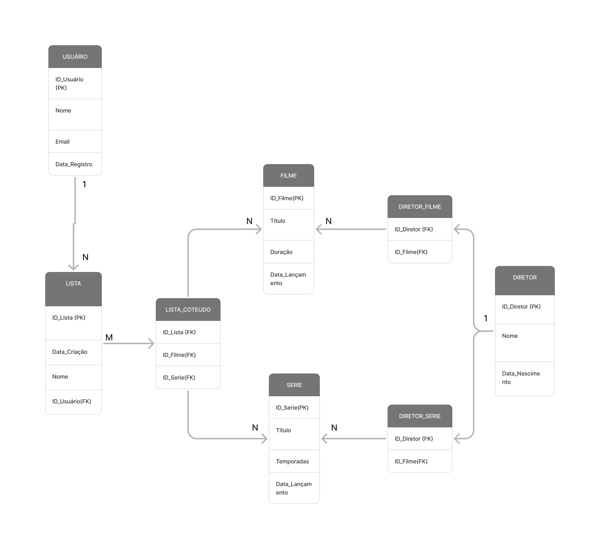

# Projeto2_CC5232
Projeto 2 da matéria Banco de Dados (CC5232)

# Integrantes 
Andre Lourenco Marques - 11.120.386-5

Henrique Barros Simões - 11.120.157-0

Leonardo Martins Qualharello - 11.120.470-7

# Modelo Entidade-Relacional

# Modelo Relacional

# Como rodar o código 

  - O arquivo query_tables.sql contém todas os códigos necessários para a construção do projeto.
  - O arquivo algebra_relacional2.sql contém todas as queries necessárias para tratar as questões de algebra relacional do projeto 
  - O arquivo conecta.py contém o código para a geração de dados aleatórios.
  - O arquivo Dados.txt contém todos os parâmetros inseridos em cada tabela.
    

    1° Para as tabelas serem criadas, basta criar um banco de dados (utilize o nome "project_netflix", para evitar erros) e executar o script query_tables.sql.
      - Importe o arquivo "algebra_relacional2.sql" dentro do seu banco
      
    2° Execute as queries no arquivo "algebra_relacional2.sql"
      - Execute o comando *use project_netflix;* primeiro
    
    3° Para a inserção dos dados aleatórios:
      - Execute o seguinte código no terminal do windows: ** pip install faker**
      - Importe o arquivo conecta.py no vscode
      - Execute o arquivo conecta.py
      - Irá gerar um arquivo chamado dados_aleatorios.sql no próprio vscode
      - Se preferir, há um arquivo dados_aleatorios.sql na branch.
      - Importe o arquivo dados_aleatorios.sql no banco de dados. Na primeira linha do arquivo escreva o comando **USE `project_netflix`;** e execute, agora é só executar o resto do script de inserção de dados
      

    
  

